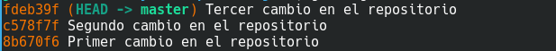
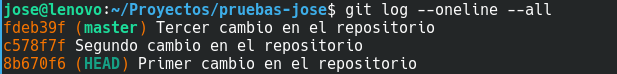

# Revisar commits realizados

En la actividad siguiente, haremos uso del comando **git checkout** para movernos por los distintos commits .

Antes de nada comprueba que tienes al menos 3 commits realizados. Para ello ejecuta:

```
git  log  --oneline --all
```

La opción --oneline, nos muestra la información de cada commit en una línea.

La opción --all,  nos muestra todos los commits.

Debería aparecerte algo semejante a la siguiente imagen:



La primera columna es un **hash**, un identificador.

Los números no están ordenados.En mi caso, el primer commit tiene un hash 8b670f6. El último commit mio es el fedb39f. 
Tú tendrás otro hash distinto. No te preocupes, es así.

La segunda columna es el mensaje que pusimos cuando hicimos el commit.

Fíjate también que en el último commit, en mi caso fedb39f, existe un **identificador HEAD**. 
Ésta es una referencia que apunta al commit en el que estamos situados en el momento actual. 
Además aparece otro **identificador master**, que indica en la rama en la que estamos. Por defecto, siempre es master.

**El identificador master siempre apunta al último commit de la rama**. 
Sin embargo el identificador HEAD podemos moverlo y desplazarmos entre distintos commit y ver como estaban los archivos en cada momento. 

Para mover el identificador HEAD utilizamos el comando **git checkout**  *numero_hash*.

Realiza los siguientes pasos y crea las capturas correspondientes:

## 1. Vamos a ver el contenido del archivo README.md en el commit actual. 

Para ello hacemos:

```
cat  README.md
```

Deben aparecer 3 líneas de texto: tu nombre, la fecha y el IES.

## 2. Vamos a movernos al primer commit. 

Para ello hacemos:

```
git  checkout  8b670f6
```

Tú deberás poner el hash que tengas.

Te aparecerá un mensaje que contiene "Te encuentras en estado 'detached HEAD'". Esto indica que la referencia HEAD no está al final de la rama. No te preocupes por ello.

Ahora veamos el contenido del archivo README.md.

```
cat README.md
```

Debe aparecer sólo una línea con tu nombre. Es el contenido que tenía dicho archivo en ese commit.

## 3. Veamos en que posición de la rama nos encontramos. Para ello ejecutamos:

```
git  log  --oneline --all
```

Debería aparecer algo semejante a la siguiente imagen:



Fíjate donde apunta la referencia HEAD en este momento. 

Algo que quizás te haya pasado desapercibido pero que es extremadamente IMPORTANTE es que cada vez que nos movemos de un commit a otro, el contenido del directorio de trabajo cambia. Esto lo hace git de forma automática.

NO REALIZAREMOS ningún cambio a los archivos, sólo vamos a echar un vistazo.

## 4. Vamos a movernos al segundo commit. 

Para ello hacemos:

```
git  checkout  c578
```

Tú deberás poner el hash que tengas. No es necesario poner todos los dígitos, podemos acortar el hash. 

Ejecuta 

```
cat README.md
```

y haz una captura de pantalla.

Deberían aparecer 2 líneas: tu nombre y la fecha.

## 5. Vuelve a hacer

```
git  log  --oneline --all
```

Y comprueba que HEAD está en el segundo commit.

## 6. Por último, 

para volver al último commit de la rama master, simplemente hacemos:

```
git  checkout master
```

Podemos ver que todo está en su sitio haciendo

```
git  log  --oneline --all
```

Haz una captura de pantalla.

> *NOTA: No borrar el repositorio local. Lo volveremos a utilizar en la siguiente actividad.*

**Subir a plataforma Moodle un documento PDF con las capturas de pantalla y explicaciones pertinentes.**
