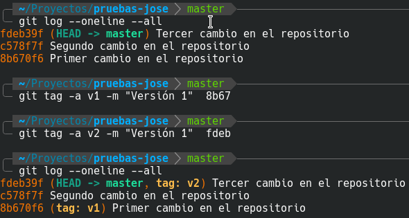
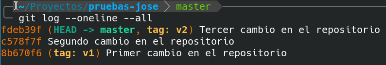
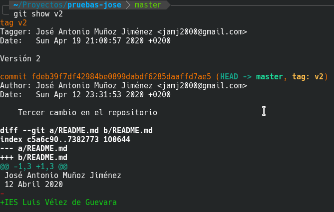

# Etiquetar commits y ver diferencias

En esta actividad vamos a ver 3 comandos:

- **git tag**
- **git show** 
- **git diff**

El primer comando (**git tag**) nos permite poner etiquetas a los commits.  **No se etiquetan todos los commits, sólo las releases que deseemos**.

Los 2 siguientes (**git show** y **git diff**) son para ver los cambios realizados entre distintos commits. Son muy parecidos aunque con pequeñas diferencias.

**Básicamente git show nos permite ver los cambios de un commit respecto al anterior, mientras que git diff nos permite ver cambios en un rango de commits**.

De todas formas tanto git show como git diff tienen tantas opciones que aquí sólo nos centraremos en las esenciales.

Empecemos.

## 1. Etiquetamos el commit primero y el tercero.

El primer commit será la versión 1 de nuestro proyecto. La etiqueta será v1.

El tercer commit será la versión 2 de nuestro proyecto. La etiqueta será v2.

El segundo commit no será etiquetado.



Para etiquetar utilizamos el comando

```
git  tag  -a  nombre_etiqueta  -m  "Mensaje"   commit_a_etiquetar
```

Por ejemplo, en mi caso:

```
git tag  -a v1  -m "Versión 1"  8b67
git tag  -a v2  -m "Versión 2"  fdeb
```

La opción -a significa annotate.

La opción -m nos permite poner un mensaje.

Finalmente debemos poner el commit al que deseamos aplicar la etiqueta.

Si por cualquier motivo nos equivocamos al crear la etiqueta podemos eliminarla con

```
git tag -d nombre_etiqueta
```

Por ejemplo, yo me equivoqué en el mensaje de v2, así que hago


## 2. Usando etiquetas para movernos

Las etiquetas nos permiten referenciar commits de una forma más cómoda que usando el identificador de hash.

Por ejemplo es más cómodo usar:

```
git checkout v1
```

que usar

```
git checkout 8b67
```

Para volver al último commit haz

```
git checkout master
```

## 3. Examinado cambios de un commit respecto al anterior.



Para ver los cambios introducidos respecto al commit anterior hacemos:

```
git show
```

En este caso, al coincidir todos los apuntadores  (HEAD, master, v2 y fdeb) al mismo sitio, el comando anterior es equivalente a

```
git show HEAD
git show master
git show fdeb
git show v2
```



Como podemos observar, se añadió una línea, la que contiene el IES.

**Las líneas añadidas aparecen en verde y con un signo +**.

**Las líneas eliminadas aparecen en rojo y con un signo -**.

En este caso sólo hemos realizado operaciones de adicción.

Para ver el cambio realizado en el commit segundo respecto al primero, hacemos

```
git show c578
```

Debe aparecer añadida la línea con la fecha.

Y para ver el cambio realizado en el commit primero respecto al repositorio vacío, hacemos

```
git show v1
```

Debe aparecer añadida la línea con el nombre.

## 4. Examinado cambios de un commit respecto a varios anteriores.

Si deseamos ver todos los cambios realizados a lo largo de varios commits, haremos uso de git diff.

La forma de uso es 

```
git  diff  commit1..commit2
```

Por ejemplo, para ver los cambios entre la versión 1 y la versión 2, hacemos

```
git  diff  v1..v2
```


Podemos ver que se han añadido 2 líneas desde el commit v1.

Es muy aconsejable poner primero el commit más antiguo y después el commit más moderno. Si lo hacemos al contrario, el resultado en lugar de aparecer en color verde aparecerá en color rojo, y su interpretación será más confusa.

## 5. Diferencia entre git show y git diff

También podemos hacer

```
git show v1..v2
```

Ejecuta dicho comando y haz una captura de pantalla. Explica brevemente la diferencia respecto a **git diff v1..v2**


> *NOTA: No borrar el repositorio local. Lo volveremos a utilizar en la siguiente actividad.*

**Subir a plataforma Moodle un documento PDF con las capturas de pantalla y explicaciones pertinentes.**
