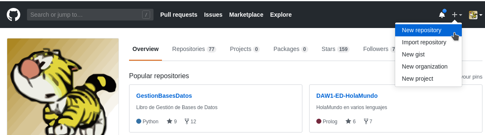
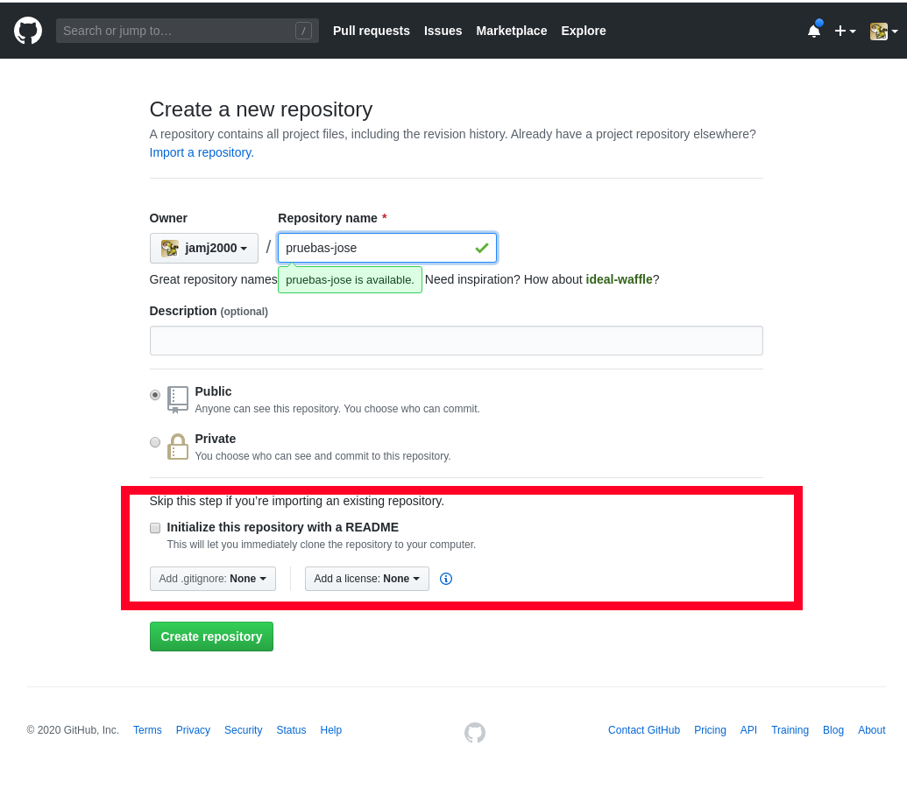
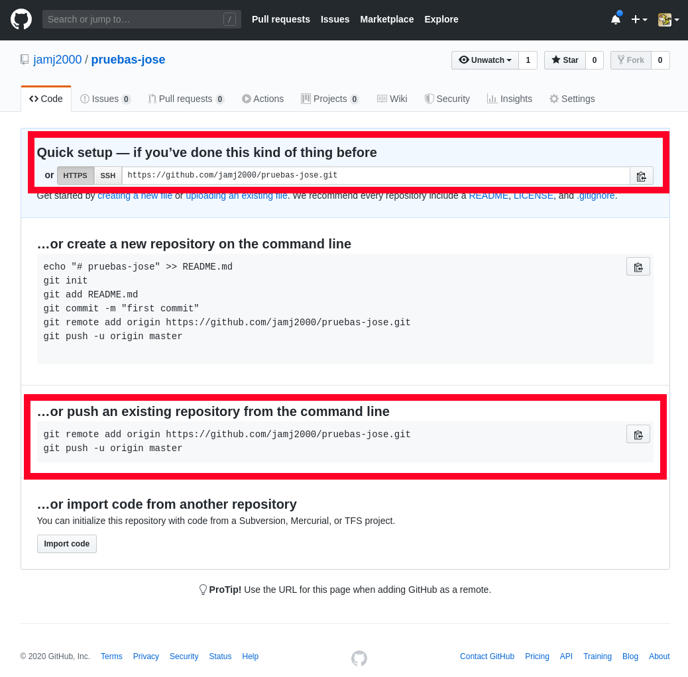
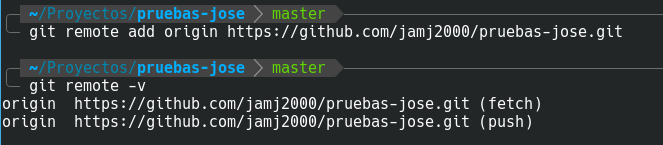
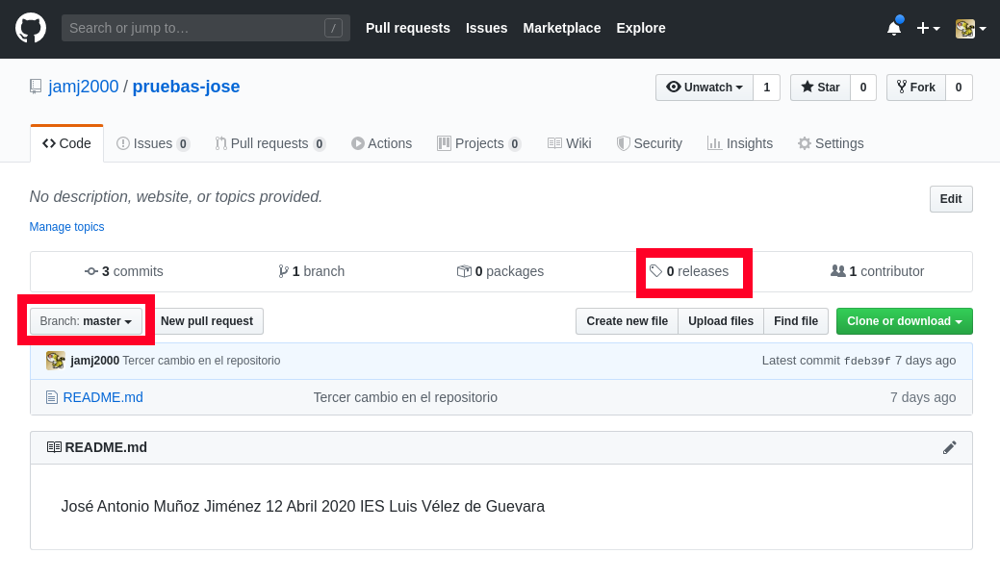
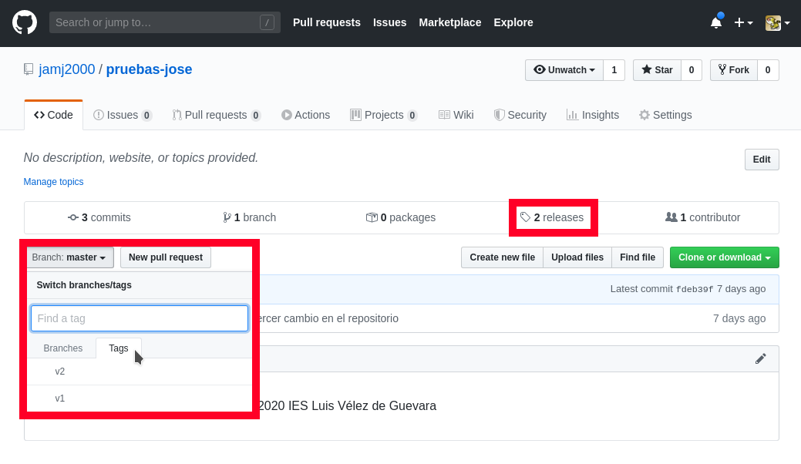

# Crear repositorio remoto y subir commits locales

En esta actividad crearemos un repositorio vacío en GitHub y subiremos el contenido de nuestro repositorio local.

## 1. Primero, creamos un repositorio totalmente vacío en GitHub.

Accedemos a nuestra cuenta de GitHub. 

En la **esquina superior derecha**, pulsamos en el signo **+** y luego en **New repository**



Escogemos el nombre del repositorio. No tiene por que coincidir con el nombre del repositorio local, aunque es lo aconsejable para no hacernos un lío.

En lugar de jose pon tu nombre.



Es muy importante que NO INICIALICES EL REPOSITORIO. Si el repositorio no estuviese vacío podría darnos un conflicto.

En una actividad posterior crearemos conflictos y veremos como resolverlos. Pero en en esta actividad, sólo vamos a trabajar lo básico.

Pulsaremos en **Create Repository** y nos aparecerá una página como la siguiente:



Ahí podemos ver la URL del repositorio remoto. Hay 2 formas de acceso:

- **mediante HTTPS**
- **mediante SSH**

**Usaremos, por ahora, HTTPS**. En una actividad posterior veremos como usar SSH y utilizar cifrado público-privado para no tener que introducir cada vez nuestras credenciales.

Más abajo se indican los comandos a ejecutar en nuestro repositorio local. Lo vemos en el siguiente punto. 

Para tu comodidad, no cierres la página. Más adelante volveremos a ella.

## 2. Asociar repositorio local con repositorio remoto

En nuestro repositorio local, para asociarlo con el repositorio remoto, hacemos:

```
git  remote  add  origin  https://github.com/jamj2000/pruebas-jose.git
```

Nuestro repositorio remoto será identificado como **origin**. Podemos ponerle otro nombre, pero no debemos. Es una convención ampliamente aceptada poner este nombre al repositorio remoto de GitHub.

Para ver si se ha añadido bien hacemos

```
git  remote  -v
```



Deben aparecer 2 entradas, una para bajada (fetch) y otra para subida (push)

> NOTA: Si por cualquier motivo nos equivocamos y escribimos mal el nombre o la URL, podemos borrar la asociación con
> ```
> git  remote  remove  origin
> ```
> y luego volver a crear la asociación. 

## 3. Subir todos los commits locales al repositorio remoto

Para subir el contenido de nuestro repositorio local al repositorio remoto hacemos:

```
git push  -u origin master
```

El identificador **origin** es el nombre que dimos a nuestro vínculo. El identificador master se refiere a la rama principal.

Es una convención ampliamente seguida, así que respétala.

Se nos pedirá nuestro usuario y contraseña. Lo introducimos, y si no hay problema, se realizará la subida.

## 4. Comprobando la subida.

Volvemos a la página de GitHub y la actualizamos.

Nos aparecerá algo semejante a esto:



GitHub ofrece muchas funcionalidades.

Así que nos centraremos ahora mismo en las releases. Estás se corresponden con el etiquetado que realizamos en la actividad anterior con git tag. 

Teníamos 2 releases, etiquetadas como v1 y v2, pero sin embargo aquí no aparece ninguna.

El motivo, es que debemos subir las etiquetas por separado con el comando 

```
git  push  --tags
```
Así que ejecutaremos dicho comando desde nuestro repositorio local. Refrescaremos la página. Et voilà ! 





## 5. Examinando commits y releases en GitHub.

**Pulsa en 3 commits** y haz una captura de pantalla. Por tu cuenta puedes examinar cada uno de los commits.

**Pulsa en 2 releases** y haz una captura de pantalla. Observa que se han creado archivos comprimidos con el código fuente para descargar.


> *NOTA: No borrar los repositorio local ni repositorio remoto. Los volveremos a utilizar en la siguiente actividad.*

**Subir a plataforma Moodle un documento PDF con las capturas de pantalla y explicaciones pertinentes.**
