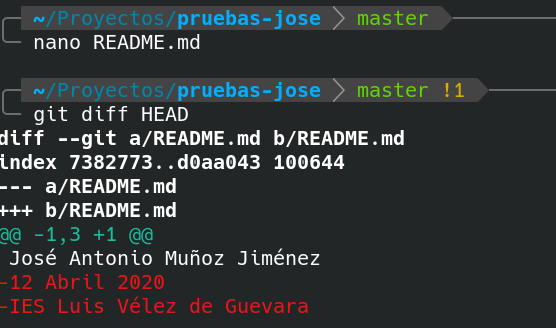
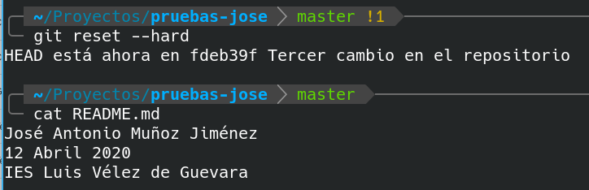
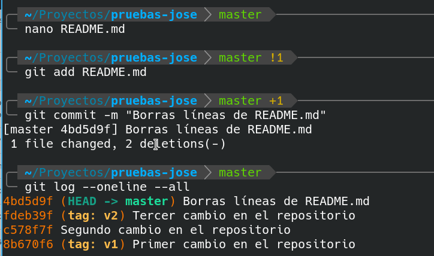
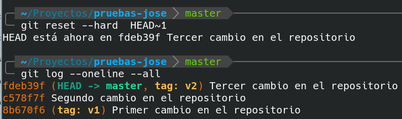

# Deshacer cambios en repositorio local

En esta actividad, veremos que podemos hacer cuando cometemos errores.

Si realizamos algún cambio y hemos "metido la pata", podemos deshacer el "entuerto".

Vamos a verlo de forma práctica haciendo uso del comando  **git reset --hard**

##  1. Deshacer cambios en el directorio de trabajo

Estando en el último commit de la rama master, modificamos el archivo README.md

Vamos a eliminar las 2 últimas líneas.

```
nano README.md
```

Editamos. Debe quedar una sola línea con nuestro nombre.

Para ver los cambios que hemos introducido ejecutamos:


**`git diff HEAD`**


Es decir vamos a ver las diferencias que existen en nuestro directorio de trabajo respecto al commit HEAD, es decir el último commit confirmado.

> NOTA: Si quisiesemos ver las diferencias de nuestro directorio de trabajo respecto al commit de la Versión 1, haríamos **git diff v1**.
> Observa que estamos viendo las diferencias hacia al pasado. Esta forma de uso de git diff es diferente a la que vimos en la última actividad, en la cual veíamos las diferencias hacia el futuro.




Se ve claramente que hemos eliminado las 2 últimas líneas. 

Para volver el estado de este archivo y de CUALQUIER OTRO de nuestro directorio de trabajo que hayamos modificado, ejecutamos:


**`git reset --hard`**




##  2. ¿Y para deshacer el área de preparación?

Imaginemos que hemos ido un poco más lejos, y que además de modificar el directorio de trabajo, hemos añadido los cambios al Staging Area. Es decir hemos hecho

```
nano README.md
```

Borrado las 2 últimas líneas.

Y luego hemos añadido al área de preparación mediante 

```
git  add  README.md
```

No te preocupes en este caso puede también aplicarse el comando anterior:

```
git  reset --hard
```

Dicho comando coge el contenido que hay en nuestro commit confirmado y recupera ambos: el directorio de trabajo y el área de preparación.

## 3. ¿Y qué pasa si ya realicé un commit?

Imaginemos que hemos ido todavía un poco más lejos, y que además de modificar el directorio de trabajo y añadir los cambios al Staging Area, hemos realizado un commit. Es decir hemos hecho

```
nano README.md
```

Borrado las 2 últimas líneas.

Y luego hemos añadido al área de preparación mediante 

```
git  add  README.md
```

Y además hemos hecho

```
git commit -m "Borras líneas de README.md"
```




Pues en este caso también podemos usar el comando **git reset --hard** de la siguiente forma:


**`git  reset --hard  HEAD~1`**



 

**HEAD~1** significa el commit anterior al actual. Es decir **un commit hacia atrás**.

**HEAD~2** significa **2 commits hacia atrás**. 

**HEAD~n** significa **n commits hacia atrás**, sustituyendo n por un número.

> **NOTA: Usar git reset --hard de esta última forma es peligroso, porque perdemos el último o últimos commits. Así que hay que asegurarse muy bien de que es eso lo que queremos**. 


> *NOTA: No borrar los repositorio local ni el remoto. Los volveremos a utilizar en la siguiente actividad.*

**Subir a plataforma Moodle un documento PDF con las capturas de pantalla y explicaciones pertinentes.**
