# Usando un par de claves SSH

Como habréis observado, cada vez que hacemos un `git push` nos pide el usuario y contraseña. Esto es bastante molesto.

Una forma de evitar esto es mediante un **par de claves SSH** (una clave privada y una clave pública). Ambas se complementa. La una sin la otra no sirve de nada.

Este método evita que nuestro usuario y contraseña de GitHub se guarde en un archivo de disco. Por tanto es muy seguro. En caso de que alguién haga login en nuestro PC podría acceder a nuestras claves. En dicho caso eliminaríamos el par de claves y volveríamos a crear unas nuevas y nuestro usuario y contraseña de GitHub nunca se verían comprometidos.

Vamos a seguir los siguientes pasos:

## 1. Generamos un par de claves SSH

Es muy sencillo. Como usuario normal (sin ser root) ejecutamos el comando

**`ssh-keygen`**

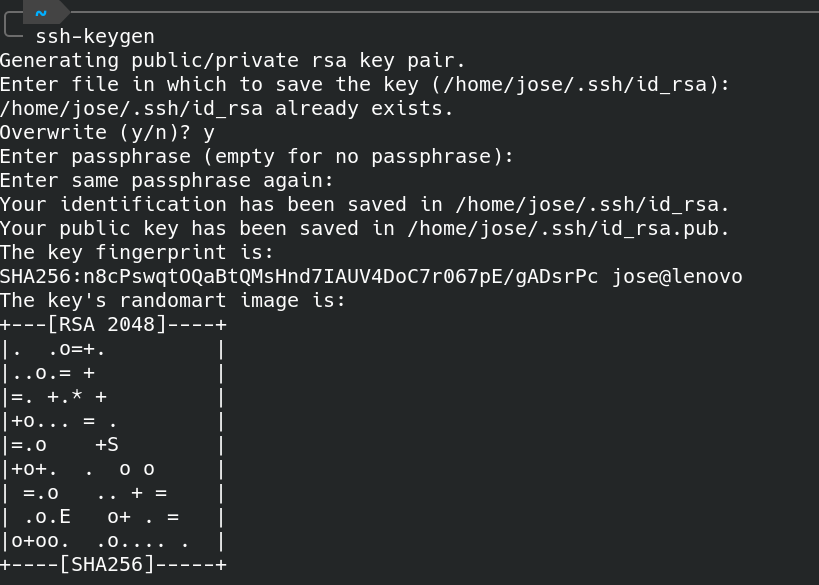

Pulsamos Intro a todo. Salvo que ya exista un par de claves previo. En ese caso nos preguntará si deseamos sobreescribir (Override (y/n)? ) En este caso, en esta pregunta respondemos y . Luego todo Intro.

Esto nos creará una carpeta **~/.ssh**  y dentro al menos 2 archivos: 

- **id_rsa**
- **id_rsa.pub**

El primero archivo corresponde a la clave privada y el segundo a la clave pública.

Copiamos el contenido de la clave pública en un editor de texto. Nos hará falta más adelante.

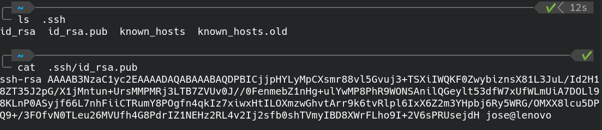

Debe copiarse  *ssh-rsa  ....  jose@lenovo* 

En vuestro caso, en lugar de jose@lenovo aparecerá otro usuario y pc.

## 2. Añadimos clave ssh pública a github.

Iniciamos sesión de GitHub y en el menú general (esquina superior derecha) seleccionamos la opción **Settings**.

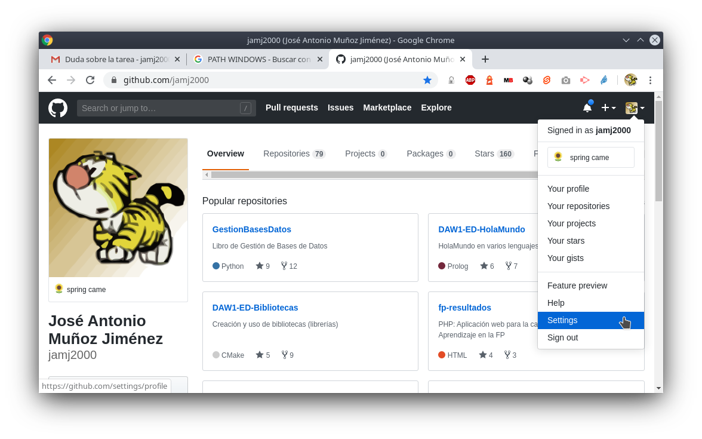

Luego, en la parte izquierda, elegimos la opción **SSH y GPG keys**

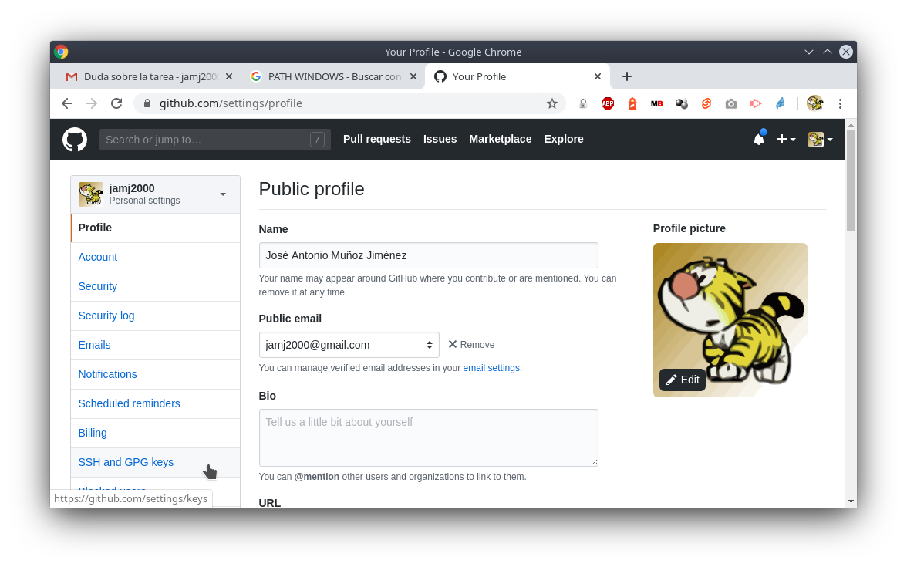


A continuación, a la derecha, pulsamos en el botón **New SSH key**

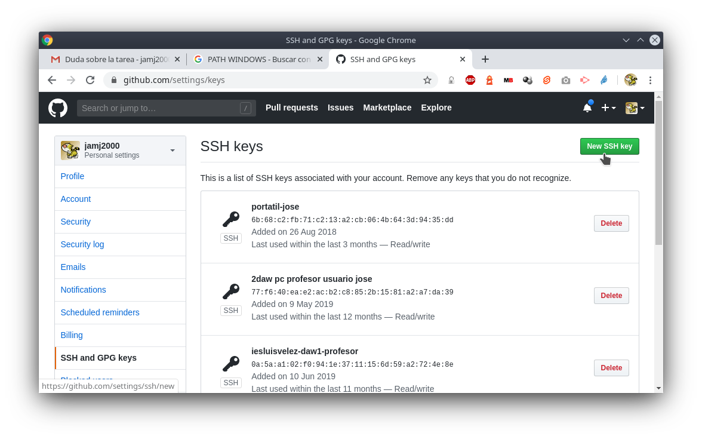

Luego ponemos un nombre a la clave, por ejemplo pc-casa. Y copiamos el contenido de la clave pública. Finalmente, pulsamos en el botón **Add SSH key**

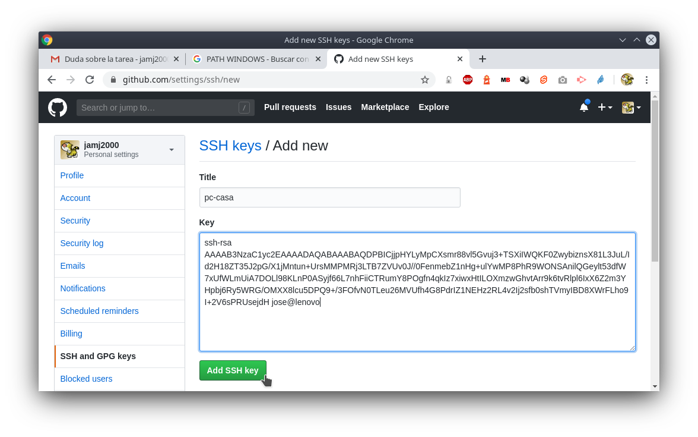

La clave anterior puede usarse para cualquiera de nuestros repositorios. Para hacer uso de ella, lo único que necesitamos es la URL en formato SSH de cada repositorio.


## 3. Comprobamos que se ha creado bien

Si, por cualquier motivo, alguien accediera a nuestro PC y cogiera la clave privada, bastaría con eliminar esta clave pública de GitHub y al ladrón no le serviría de nada nuestra clave privada.

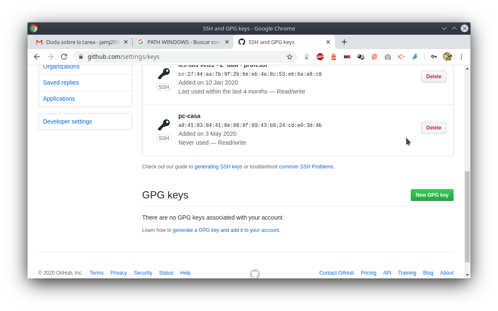


## 4. Obteniendo URL SSH del repositorio

Botón **Clone or download**, **Use SSH**

Copiamos URL en formato SSH. Su formato es relativamente fácil de memorizar. Siempre git@githbub.com seguido de dos puntos :  y luego el nombre de usuario / nombre de repositorio.

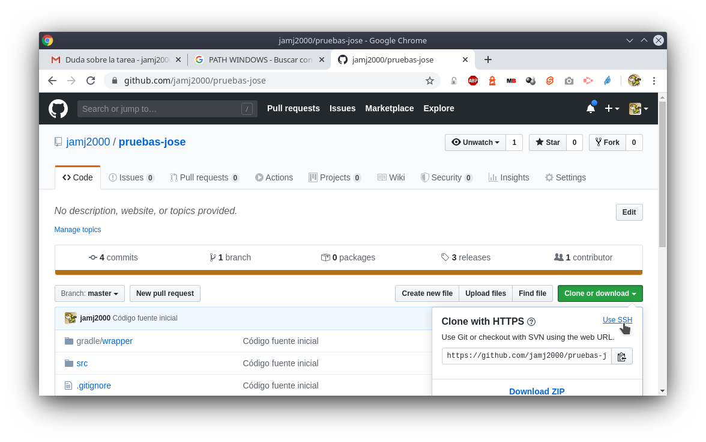

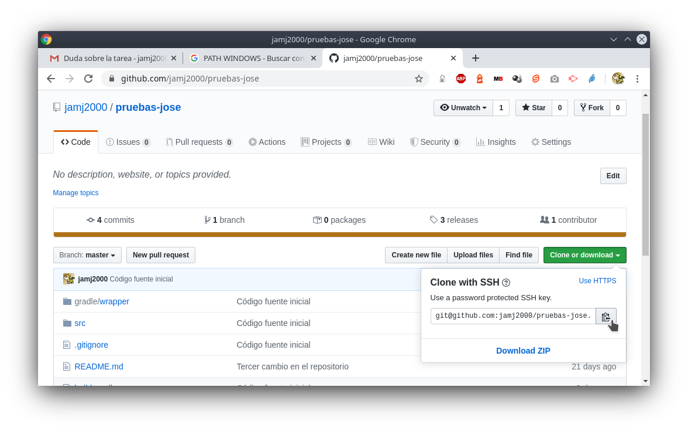

## 5. Asociando nuestro repositorio local mediante SSH

Nuestro repositorio local estaba asociado a origin mediante HTTPS. Debemos dar de baja dicho enlace y crear uno nuevo que haga uso del protocolo SSH.

Ejecutamos

**`git  remote  remove  origin`**

**`git  remote  add  origin   git@github.com:`** *`tu_usuario/tu_repositorio`*

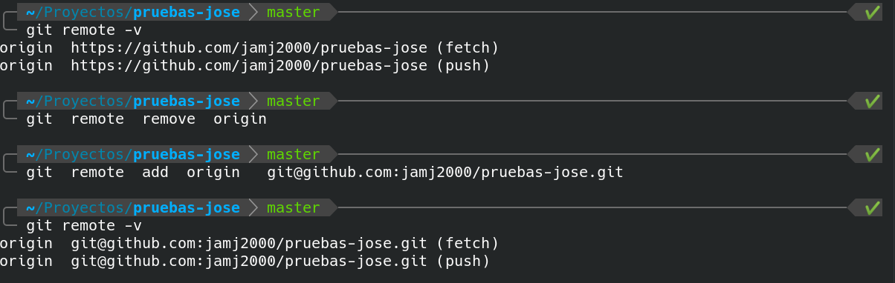


## 6. Creamos un commit y subimos a GitHub.

Para comprobar que no nos pide usuario y contraseña cuando hagamos git push, vamos a modificar el archivo README.md , crear un commit y subir a GitHub.

Pondremos al principio de cada línea el símbolo >  y un espacio. El archivo README.md quedaría más o menos así:

```
> José Antonio Muñoz Jiménez
> 12 Abril 2020
> IES Luis Vélez de Guevara
```

Luego guardamos. Ejecutamos

```
git add README.md
git commit -m "Añadida cita"
git push -u origin master
```

Al ejecutar el último comando, se realizará una conexión SSH con GitHub.

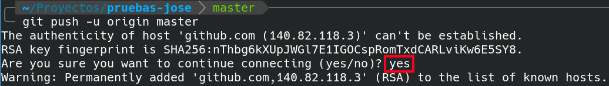

Cuando se realiza una conexión SSH con una nueva clave, la primera vez se pide confirmación y deberás escribir **yes**.
Después de ello, quedará registrado el host remoto en el archivo **.ssh/known_hosts**. Las siguientes veces ya no se pide confirmación, siempre que el archivo `.ssh/known_hosts` contenga dichos registros.

> *NOTA: No borrar los repositorio local ni repositorio remoto. Los volveremos a utilizar en la siguiente actividad.*

**Subir a plataforma Moodle un documento PDF con las capturas de pantalla y explicaciones pertinentes.**
