# Resolviendo conflictos

En esta actividad veremos qué se entiende por conflicto, cuándo se produce y cómo resolverlo.

Como sabéis un mismo repositorio puede tener copias en distintos sitios. 
Ahora mismo tenemos una copia en GitHub y otra local en nuestro PC. 
Pero podrían existir más copias locales en otros PC.

Siempre que realicemos cambios (es decir commits) en el mismo archivo en las mismas líneas pero en copias distintas,
se producirá un conflicto.

Para ver esto, vamos a hacer un commit en nuestro repositorio en GitHub,
y luego haremos un commit en nuestro repositorio local. Trabajaremos con el archivo `README.md` únicamente.

## 1. Modificamos archivo README.md remoto

En GitHub vamos a modificar el archivo `README.md` y registrar el cambio (commit).

Para ello, entramos en nuestro repositorio remoto, pulsamos sobre el archivo `README.md`
y luego pulsamos sobre el lápiz para editar.
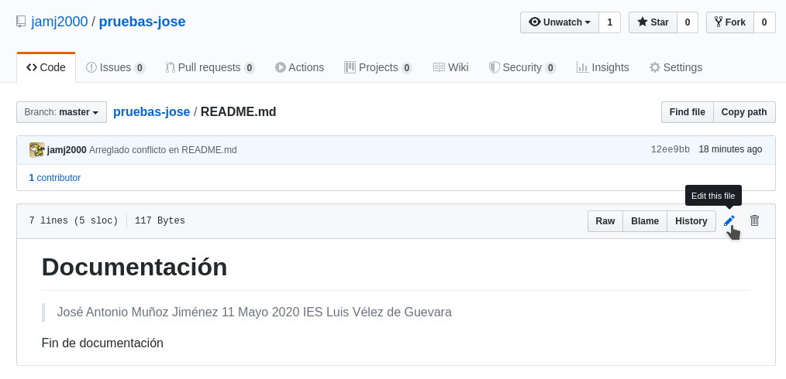


**Insertamos una primera línea con título # y modificamos la línea de la fecha**.

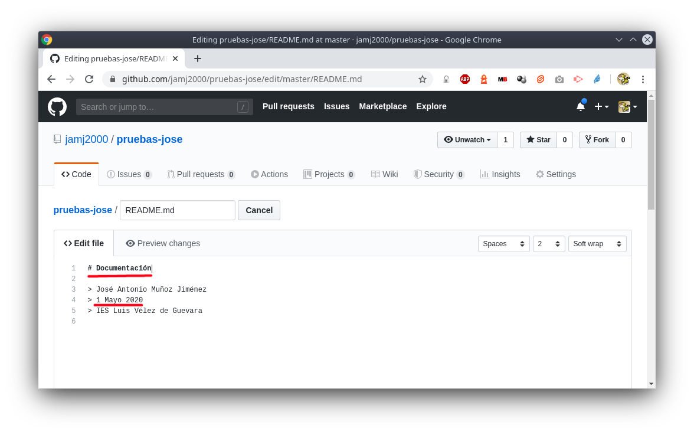


Registramos commit. Para ello pulsamos en **Commit changes**

Si lo deseamos, podemos poner un mensaje al commit y un descripción, aunque no es obligatorio.  
GitHub pone una por defecto.


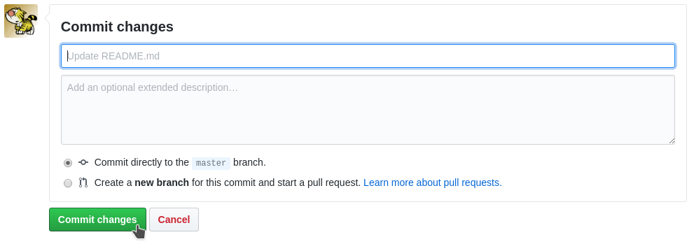


## 2. Modificamos archivo README.md local

En nuestro repositorio local, también vamos a modificar el archivo README.md.

En este caso añadiremos una línea al final del archivo y modificaremos la línea de la fecha.

```
nano  README.md
```

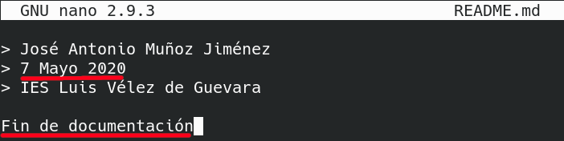

Guardamos los cambios y registramos commit.

```
git add README.md
git commit -m "Actualización de README.md"
```

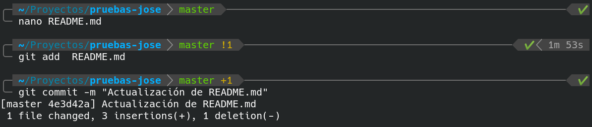

## 3. Intentamos subir el commit local

Al intentar subir nuestro commit local al repositorio remoto,  se rechazará.

```
git  push
```

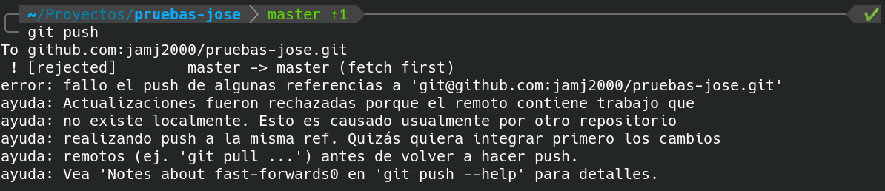

**Esto no es un conflicto. 
Simplemente nos dice que debemos actualizar antes nuestro repositorio local con el contenido del repositorio remoto**.

Si hemos realizado cambios en nuestro repositorio remoto, deberemos integrarlos en nuestro repositorio local
antes de poder subir nuevos cambios locales.

## 4. Se produce conflicto

Así que hacemos

**`git  pull`**

para **bajar los commits del repositorio remoto** que no tenemos en local.

**Esto no tendría por que provocar un conflicto. 
Pero en este caso sí se produce, porque hemos modificado el mismo archivo (`README.md`)
y además en la misma linea (la línea de la fecha)**.

Así que se realiza la fusión, pero nos avisa que hay conflicto en dicho archivo. Deberemos resolverlo manualmente.

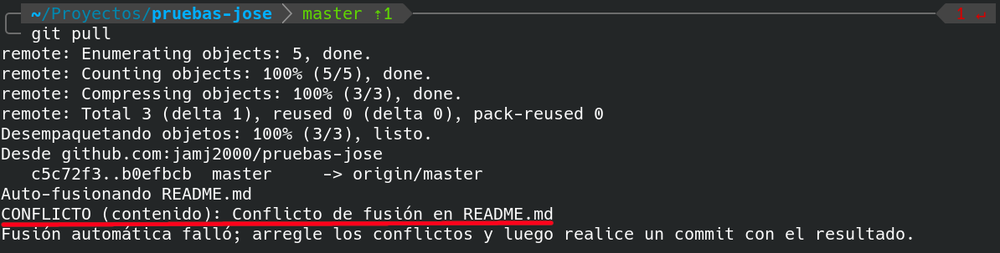

## 5. Arreglamos conflicto

Para arreglar el conflicto, abrimos el archivo en cuestión y en la línea o líneas donde se ha producido el conflicto veremos unas marcas como las siguientes:

**`<<<<<<<`**
```
    línea o líneas en commit local
```  
**`=======`**
```
    línea o líneas en commit remoto
```
**`>>>>>>>`**

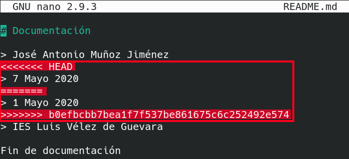

**Resolver el conflicto consiste en elegir una de las 2 opciones y eliminar las marcas anteriores**. 
Aunque también podemos no elegir ninguna de las opciones y escribir otra en su lugar.
Esto es lo que yo he hecho aquí al poner fecha 11 Mayo.

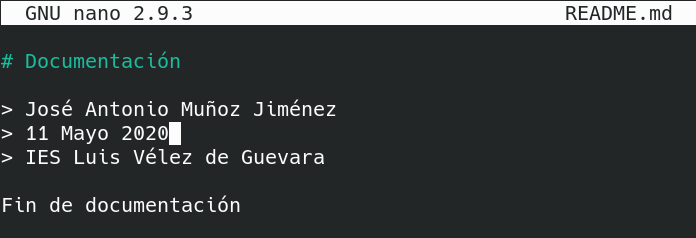

A continuación, guardamos los cambios. Y registramos un nuevo commit.

```
git add README.md
git commit  -m "Arreglado conflicto en README.md"
```

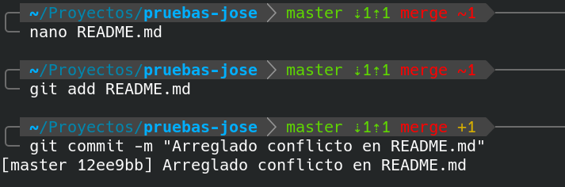

Ahora ya podremos subir nuestro commit con el conflicto solucionado.

**`git push`**

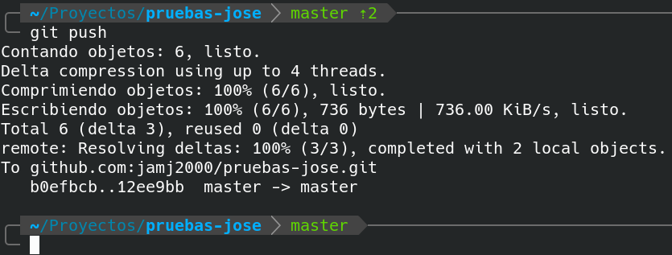


> *NOTA: Para evitar situaciones como la anterior, es aconsejable no realizar modificaciones en GitHub, y si las hemos realizado o hemos subido commits desde otro repositorio local, lo primero que deberíamos hacer es git pull,  resolver los conflictos que puedan darse, realizar los commits locales que deseemos y finalmente subir commits a GitHub. Resumiendo, una buena estrategia puede ser la siguiente: al principio del día haremos git pull, y al final del día haremos git push.*

> *NOTA: No borrar los repositorio local ni repositorio remoto. Los volveremos a utilizar en la siguiente actividad.*

**Subir a plataforma Moodle un documento PDF con las capturas de pantalla y explicaciones pertinentes.**
