# Creación de ramas

En esta actividad vamos a empezar a trabajar con ramas. En concreto veremos como **crear nuevas ramas**.

Podemos definir una rama como un **desarrollo paralelo dentro del mismo repositorio**. Podemos iniciar dicho desarrollo paralelo en cualquier commit.

En esencia, las principales finalidades de las ramas son 2:

- **hacer cambios en el repositorio sin afectar a la rama master**. También aplicable a otras ramas.
- **hacer cambios en el repositorio e integrarlos posteriormente en la rama master**. También aplicable a otras ramas 

Por defecto cada repositorio de git dispone de una **rama master**. Ésta es la rama principal. 
Por motivos de seguridad, suele ser frecuente realizar los cambios en alguna otra rama y posteriormente integrarlos en la rama master. 
Existen **flujos de trabajo** ( [workflows](https://buddy.works/blog/5-types-of-git-workflows) ) en los que apenas se crean commits en la rama master, sólo se integran commits de otras ramas.

En esta actividad usaremos 2 métodos para trabajar con nuevas ramas:

 - **`git checkout -b`** *`nueva-rama`*
 - **`git branch`** *`nueva-rama`* , y luego **`git checkout`** *`nueva-rama`*

Comprobemos antes, el estado actual de nuestro repositorio. Con `git log ...` podemos ver que sólo tenemos la rama master. 

Para ello ejecutamos

**`git log --oneline --all --graph`**

La opción **`--graph`** nos permite ver las ramas de forma "gráfica".

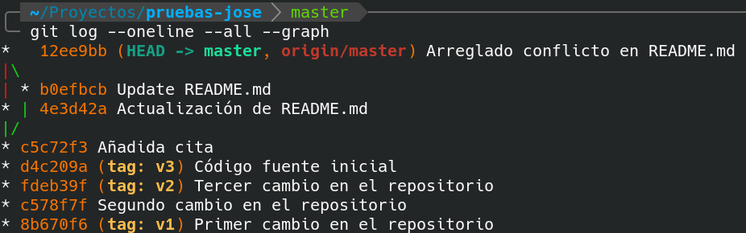

Podemos ver también "otra rama" sin nombre con el commit `b0ef` `Update README.md`. 
En realidad éste es el commit que editamos en GitHub en una actividad anterior y que tuvimos que fusionar en la rama local master, antes de volver a subirlo a GitHub.

# 1. Crear rama mediante git checkout -b ...

El comando `git checkout -b  nueva-rama` tiene esencialmente 2 formas:

1. **`git checkout -b  nueva-rama`**  (Creamos una nueva rama a partir del commit actual, y nos pasamos a ella)
2. **`git checkout -b  nueva-rama  commit-de-partida`**  (Creamos una nueva rama a partir del commit indicado, y nos pasamos a ella)

En este apartado vamos a crear 2 ramas (las llamaremos `rama1` y `rama2`) a partir del primer commit, 
es decir el commit más antiguo, que tenemos etiquetado como `v1`.

Para crear `rama1` y movernos a ella, vamos a usar la forma más directa. Para ello hacemos:

**`git checkout -b rama1 v1`**

En dicha `rama1`, creamos un nuevo commit.

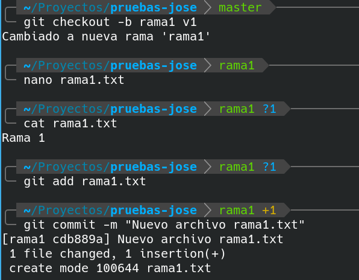	

 El resultado es

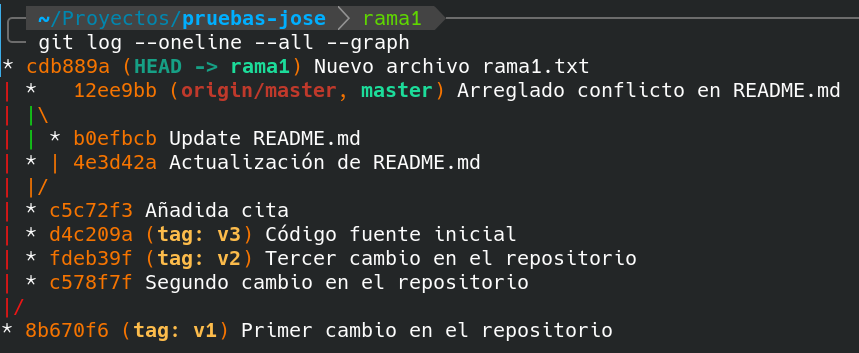

Ahora hagamos otra rama llamada `rama2` a partir del commit `v1`, de una forma un poco distinta.

Imaginemos que, por despiste, nos hemos movido al commit `v1` con

**`git checkout v1`**

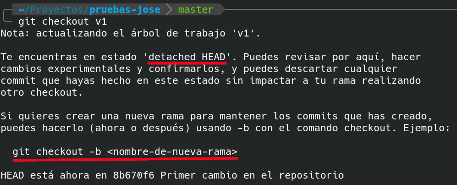	

Como se nos informa en el mensaje, ahora mismo estamos trabajando en modo *despegado* (detached HEAD). 
Esto nos permite realizar los cambios que deseemos creando commits sin afectar a la rama master.

Lo aconsejable es ejecutar ahora el comando `git checkout -b rama2`, 
porque después se nos podría olvidar, y al cambiar de rama perderíamos los commits realizados. 

No obstante, vamos a simular que se nos olvida ejecutar el comando anterior. 
Empezamos a realizar commits. En este caso para simplificar, solo realizaremos un commit.

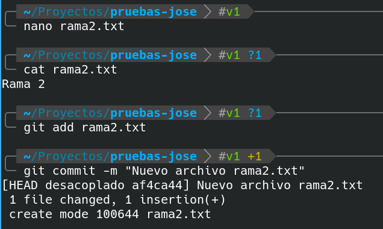	

Esto nos crea un nuevo commit. Ejecutamos una vez más

**`git log --oneline --all --graph`**

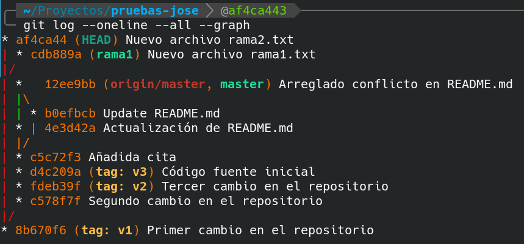	

Como se muestra en la captura, no existe ningún apuntador en forma de rama, así que si ahora, por ejemplo, 
ejecutasemos `git checkout master`, 
perderíamos todos los commits realizados (en este caso sólo uno, pero podrían ser muchos más).

Si no deseamos perder dichos commits, debemos ejecutar 

**`git checkout -b rama2`**

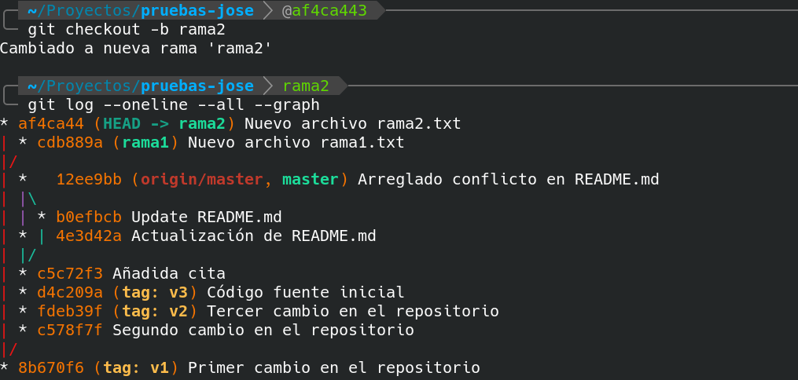	

Después de esto, ya podremos cambiar de rama con `git checkout` sin miedo a perder los commits realizados anteriormente. 

Asegúrate de ejecutar el comando anterior antes de pasar al punto siguiente.

# 2. Crear ramas con git branch ...

El comando `git branch  nueva-rama` tiene esencialmente 2 formas:

1. **`git branch  nueva-rama`**  (Creamos una nueva rama a partir del commit actual, pero NO nos pasamos a ella)
2. **`git branch  nueva-rama  commit-de-partida`**  (Creamos una nueva rama a partir del commit indicado, pero NO nos pasamos a ella)

Después de ejecutar una de las formas anteriores, siempre deberemos hacer después un `git checkout`
si queremos trabajar con la nueva rama.

Vamos a ver su uso, haciendo uso de la segunda forma. Desde la rama actual, es decir rama2, vamos a crear 2 ramas (llamadas licencia y autor) a partir de la rama master.

```
git branch licencia master
git branch autor    master
```

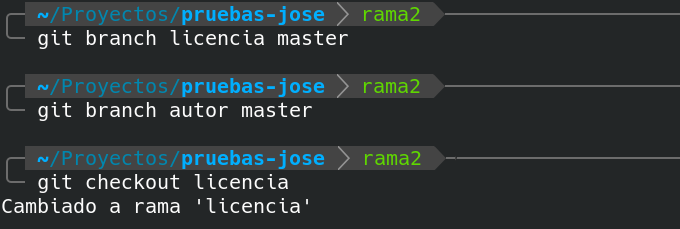

Para empezar a trabajar con alguna de ellas, deberemos ejecutar `git checkout ...` Por ejemplo

**`git checkout licencia`**

Con `git log --oneline --all --graph` podemos ver que el apuntador **`HEAD`** ahora apunta a la rama `licencia`.

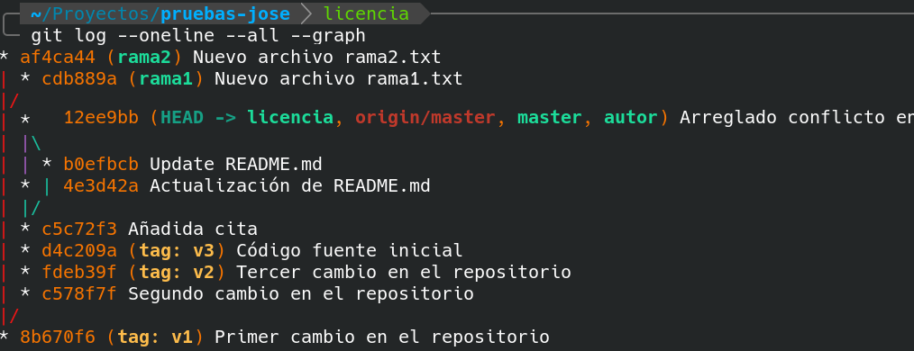	

En esta rama crearemos un archivo nuevo llamado `LICENSE`.

Para ello hacemos

```
nano LICENSE
```

Escribimos dentro un línea con el texto siguiente: **GPL v3**

Y realizamos commit

```
git add LICENSE
git commit -m "Nuevo archivo LICENSE"
```

Para trabajar con la rama `autor`, ejecutamos

```
git checkout autor
```

En esta rama vamos a crear un archivo `AUTHOR` y además vamos a modificar el archivo `README.md`.

Para ello hacemos

``` 
nano AUTHOR
```

Escribimos dentro un línea con el texto siguiente: **JOSÉ ANTONIO MUÑOZ JIMÉNEZ**

También modificaremos el archivo `README.md`. 
En la línea donde aparece nuestro nombre, cambiaremos el texto para ponerlo todo en mayúsculas. 
La finalidad es provocar un conflicto de fusión en un futuro, que resolveremos en la siguiente actividad.

Y realizamos commit

```
git add AUTHOR
git commit -m "Nuevo archivo AUTHOR y editado README.md"
```

El resultado de `git log --oneline --all --graph` es 

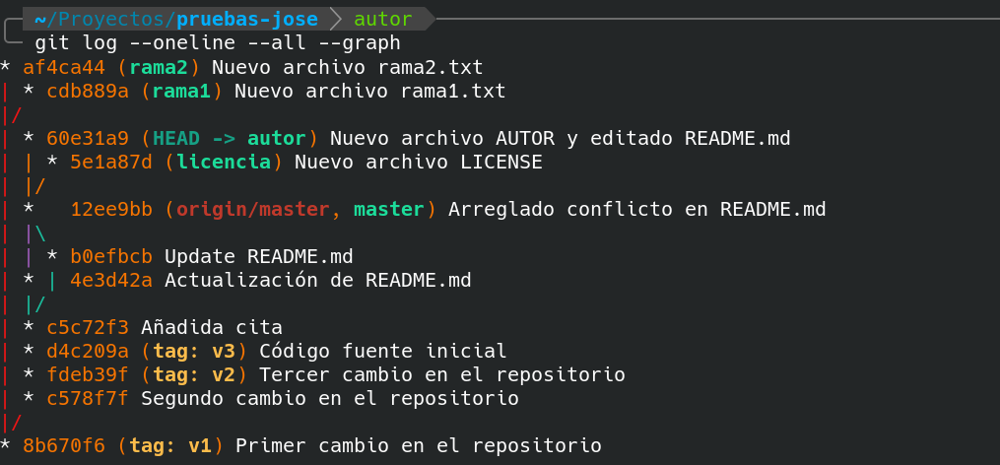	

## 3. Subir ramas a repositorio remoto

Para subir todos los cambios realizados en todas las ramas ejecutamos

**`git push origin --all`**

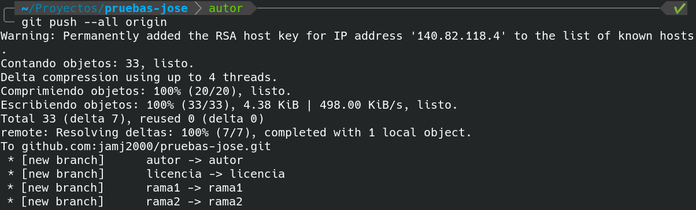	

El resultado es que todos los apuntadores a ramas remotas se actualizan (aparecen en color rojo en la siguiente captura)

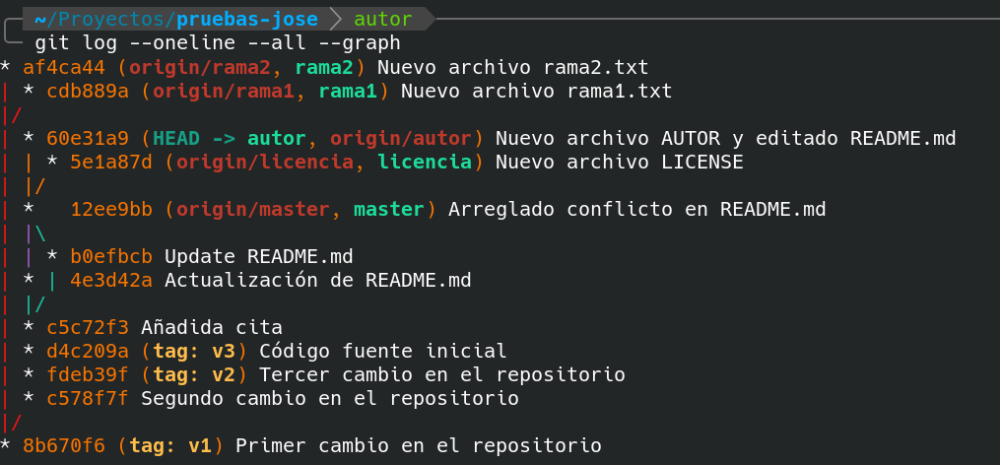	

En **GitHub**, dentro del repositorio correspondiente, 
podemos ver un gráfico de las ramas pulsando en la pestaña **`Insights`** y luego en la opción **`Network`** (en la parte izquierda de la nueva página) 

	


> *NOTA: No borrar los repositorio local ni repositorio remoto. Los volveremos a utilizar en la siguiente actividad.*

**Subir a plataforma Moodle un documento PDF con las capturas de pantalla y explicaciones pertinentes.**
