# Fusión y eliminación de ramas

Esta actividad es una continuación de la anterior. En ella veremos como realizar **fusión de ramas** (**merge**)
y como eliminar apuntadores a ramas antiguas.

Vamos a suponer que hemos trabajado en las ramas de la actividad anterior (`rama1`, `rama2`, `licencia` y `autor`)
añadiendo varios commits más, aunque realmente no ha sido así. Las ramas con un único commit no suelen ser tan frecuentes.

Y llega el momento de desechar el trabajo realizado en alguna rama e integrar el contenido de otras en la rama `master`.

**En esta actividad desecharemos el trabajo realizado en `rama2`, e integraremos en `master` las ramas `rama1`, `licencia`
y `autor`**.

Para realizar fusión (merge) de ramas se utiliza el comando

**`git merge ...`**

## 1. Eliminando una rama local

Para eliminar una rama local se usa el comando

**`git branch -d  rama`**

Por ejemplo, para borrar `rama2` hacemos

**`git branch -d rama2`**

No se ejecuta la eliminación, puesto que los cambios no han sido integrados en `master`, ni en ninguna otra rama. 
Para forzar la eliminación hacemos

**`git branch -D rama2`**

De esta manera perdemos todas las modificaciones que hubiésemos realizado en dicha rama.

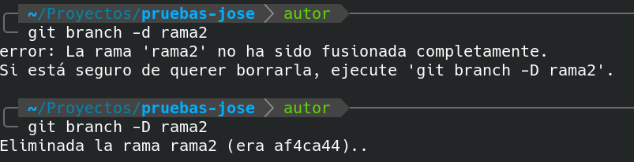

## 2. Fusionando ramas locales 

Vamos a integrar en la rama `master` los cambios realizados en `rama1`, `licencia` y `autor`.

Procederemos de la siguiente forma:

1. Cambiamos a rama master
2. Fusionamos rama licencia
3. Fusionamos rama autor
4. Fusionamos rama rama1

### 2.1. Cambiamos a rama master

Es **MUY IMPORTANTE** cambiar a la rama `master`. 
Si no hacemos el cambio, todas las fusiones se realizarían sobre la rama `autor` (la rama en la que actualmente estamos).

Debemos hacer

**`git  checkout master`**

### 2.2. Fusionamos rama licencia

Antes, fijémonos en la estructura de las ramas. Hacemos 

**`git log --oneline --all --graph`**

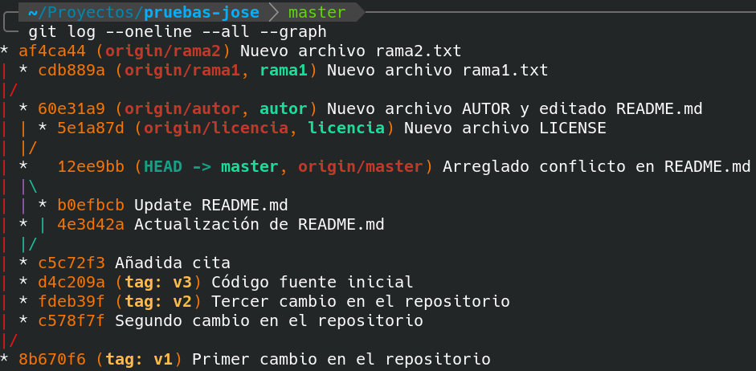	

Observa que fusionar la rama `licencia` en la rama `master` es equivalente a mover los apuntadores `HEAD` y `master` 
hacia arriba, es decir, hacerlos coincidir con el apuntador `licencia`.

Este tipo de fusión es el más sencillo y nunca da conflictos. Se conoce como **fast-forward merge** (abreviado **FF**)
o **fusión con avance rápido**.

Para fusionar esta rama hacemos

**`git merge licencia`**

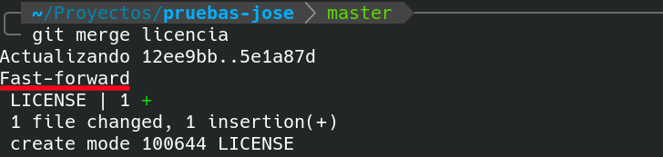	

Observa como queda tras la fusión. Únicamente se han movido los apuntadores `HEAD` y `master`.

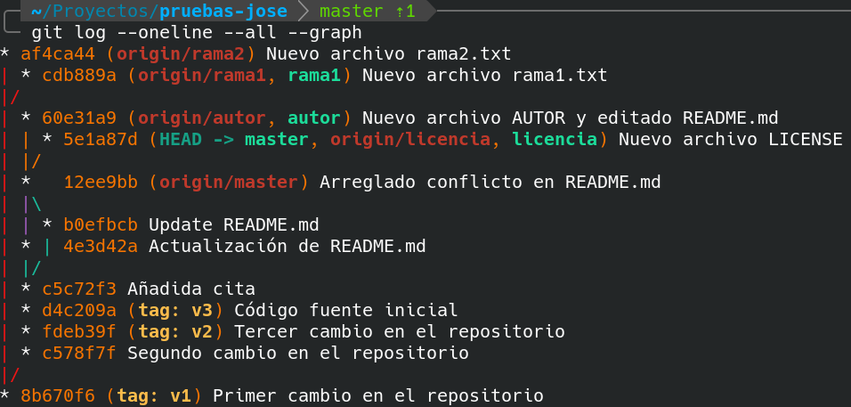	

> **NOTA: No te preocupes ahora mismo por los apuntadores remotos (los que aparecen en color rojo).
> Más adelante los sincronizaremos con el repositorio remoto.**

### 2.3. Fusionamos rama autor

Si en lugar de fusionar una rama que está adelantada respecto a `master`, 
lo que hacemos es fusionar una rama que está en paralelo con la rama `master`, 
entonces realizaremos una **fusión de 3 vías** (**3-way merge**)

Este tipo de fusión puede provocar conflictos. Si ambas ramas contienen modificaciones en las mismas líneas 
en los mismos archivos puede producirse un conflicto.

En este caso, el archivo `README.md` posee una línea con el nombre del autor, 
pero con líneas distintas en las ramas `master` y `autor` (todo en mayúsculas). 

Para realizar la fusión ejecutamos

**`git merge autor`**

Cuando aparezca el editor con el mensaje asociado, aceptaremos el mensaje o lo editaremos a nuestro gusto.

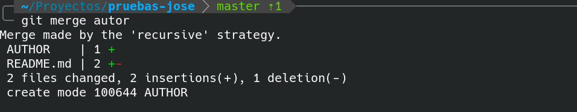	

En este caso no llegó a producirse el conflicto. Se resolvió automáticamente a favor del contenido de la rama `autor`.
Por tanto el autor en el archivo `README.md` aparecerá todo en mayúsculas.

Fíjate como se ha creado un nuevo commit resultado de unir la rama `autor` y la rama `master`. 
Esto siempre sucede en la fusión de 3 vías.

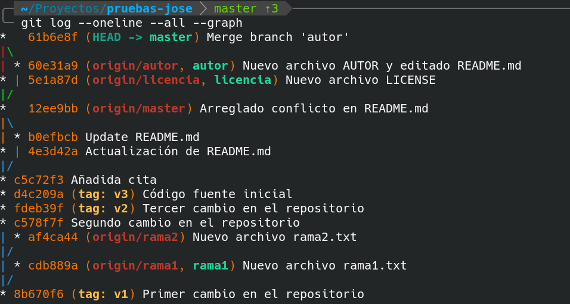	

### 2.4. Fusionamos rama rama1

Por último, integraremos en master los cambios realizados en la `rama1`. 
Es un tipo de **fusión de 3 vías**, al igual que el anterior.

En este caso, no se producirá ningún conflicto, puesto que en está rama sólo hemos realizados cambios 
sobre el archivo `rama1.txt`, el cual no existe en la rama `master`.

Para realizar la fusión hacemos

**`git merge rama1`**

Cuando aparezca el editor con el mensaje asociado, aceptaremos el mensaje o lo editaremos a nuestro gusto.

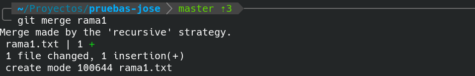	

## 3. Subiendo cambios a repositorio remoto

Para subir al repositorio remoto todos los cambios realizados en nuestro repositorio local, ejecutamos

**`git push origin --all`**
	
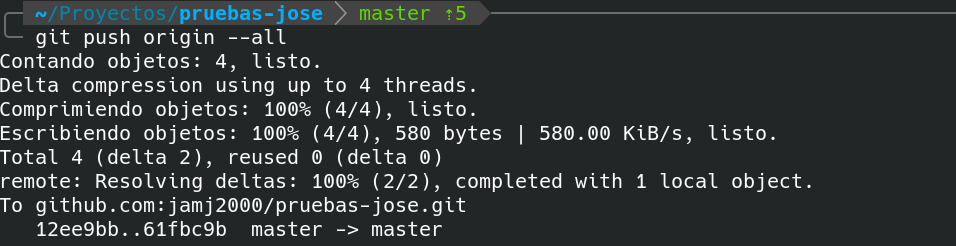	

## 4. Eliminando apuntadores a ramas locales

Para eliminar los apuntadores locales ejecutamos

**`git branch -d rama1`**

Los apuntadores a `licencia` y `autor` no los eliminaremos, por si en el futuro deseamos seguir trabajando en dichas ramas.
	
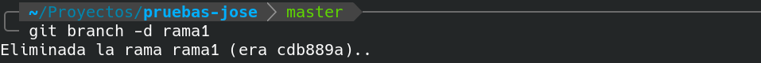

## 5. Eliminando apuntadores a ramas remotas

Para eliminar los apuntadores en el repositorio remoto, ejecutamos

**`git push origin --delete rama1`**

**`git push origin --delete rama2`**

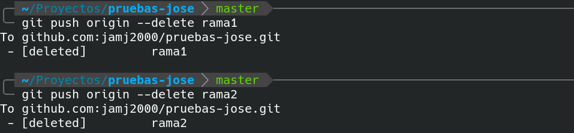

Los apuntadores a `origin/licencia` y `origin/autor` no los eliminaremos, 
por si en el futuro deseamos seguir trabajando en dichas ramas.

Para ver el estado ejecutamos `git log ...`
Observa como las ramas están actualizadas y sincronizadas con el repositorio remoto.

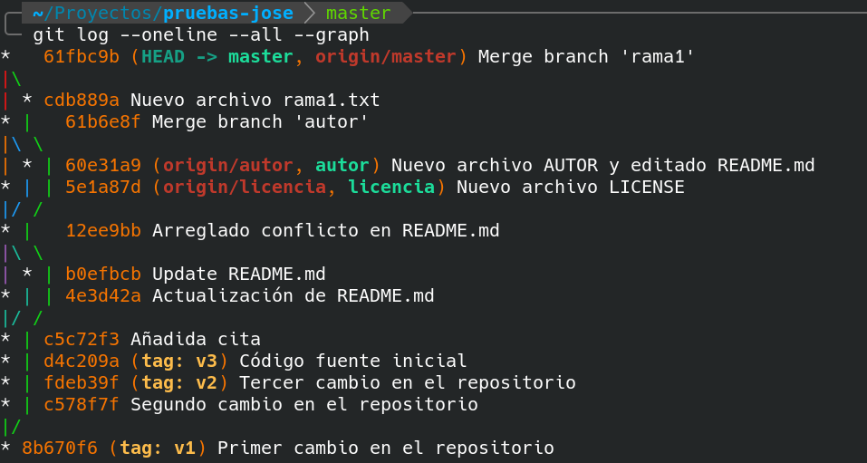

## 6. Comprobando cambios en repositorio remoto

Para ver un gráfico de las ramas en el repositorio remoto pulsamos en **Insights**, **Network**.

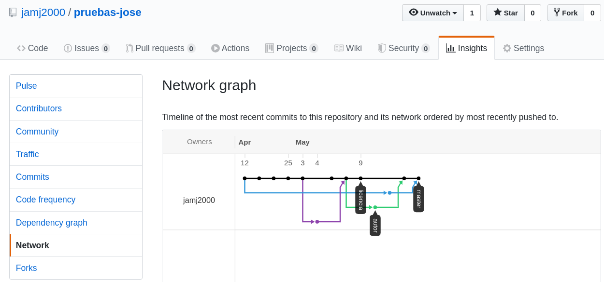

## 7. Tarea propuesta para el alumno/a

Como tarea, se propone

- volver a la rama `licencia`, añadir contenido al archivo `LICENSE` y hacer commit.
- volver a la rama `autor`, añadir contenido al archivo `AUTHOR` y hacer commit.
- integrar los cambios de ambas ramas en la rama `master`.
